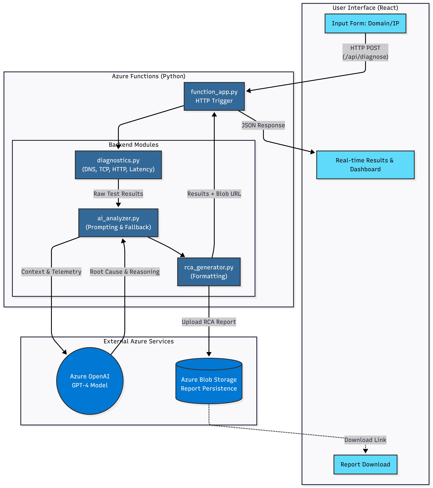

# 🚀 AI-Powered Network RCA Platform

**Real-time network diagnostics with Azure OpenAI intelligence**

[](https://render.com)

---

## ✨ Features

- 🔍 **Real Network Diagnostics** - DNS, TCP, HTTP, Latency tests
- 🧠 **AI-Powered Analysis** - Azure OpenAI GPT-4 root cause analysis
- 📊 **Enterprise Features** - Incident context, change awareness, responsibility classification
- 📄 **Multi-Format Reports** - Technical, Executive, and JSON reports
- ☁️ **Cloud Storage** - Azure Blob Storage for report persistence

---

## 🏗️ Architecture



The platform leverages a React frontend and a Python backend (Azure Functions) to perform real-time network diagnostics. Azure OpenAI (GPT-4) acts as the intelligence layer to analyze the diagnostic results and identify root causes, which are then stored in Azure Blob Storage.

---

## 📦 Project Structure

```
ai-network-rca/
├── backend/              # Python backend
│   ├── function_app.py   # Main entry point
│   ├── diagnostics.py    # Network tests
│   ├── ai_analyzer.py    # AI integration
│   └── rca_generator.py  # Report generation
├── frontend/             # React frontend
│   ├── src/
│   │   ├── App.js        # Main component
│   │   └── App.css       # Styling
│   └── public/
└── README.md
```

---

## 🚀 Quick Start (Local Development)

### Prerequisites

- Python 3.11+
- Node.js 18+
- Azure OpenAI account
- Azure Storage account

### Backend Setup

```bash
cd backend
python -m venv venv
venv\Scripts\activate  # Windows
pip install -r requirements.txt

# Create local.settings.json with your credentials
# See CREDENTIALS_NEEDED.md for details

# Run locally
func start --cors http://localhost:3000
```

### Frontend Setup

```bash
cd frontend
npm install
npm start
```

Visit: http://localhost:3000

---

## 📚 Documentation

- [QUICKSTART.md](QUICKSTART.md) - Quick setup guide
- [DEPLOYMENT_GUIDE.md](DEPLOYMENT_GUIDE.md) - Detailed deployment guide
- [ENTERPRISE_FEATURES.md](ENTERPRISE_FEATURES.md) - Enterprise features documentation
- [TESTING_GUIDE.md](TESTING_GUIDE.md) - Testing guide with 50+ test cases
- [ARCHITECTURE.md](ARCHITECTURE.md) - Technical architecture
- [CREDENTIALS_NEEDED.md](CREDENTIALS_NEEDED.md) - Required credentials

---

## 🧪 Testing

### Test Scenarios

1. **Success:** `google.com` → All tests pass
2. **DNS Failure:** `nonexistent-domain.com` → DNS fails
3. **Port Blocked:** `google.com:9999` → TCP fails
4. **Enterprise Context:** Add incident metadata for advanced analysis

See [TESTING_GUIDE.md](TESTING_GUIDE.md) for comprehensive test cases.

---

## 🛠️ Tech Stack

**Backend:**
- Python 3.11
- Azure Functions
- Azure OpenAI (GPT-4)
- Azure Blob Storage

**Frontend:**
- React 18
- Axios
- Modern CSS

**Diagnostics:**
- DNS Resolution (socket)
- TCP Connectivity (socket)
- HTTP/HTTPS Status (requests)
- Latency Measurement

---

## 🔒 Security

- Environment variables for sensitive data
- CORS configuration
- Input validation
- Secure credential storage

---

## 📊 Enterprise Features

1. **Incident Context Awareness** - Capture timing, detection, user impact
2. **Change-Aware RCA** - Correlate recent changes with failures
3. **Dual RCA Output** - Technical, Executive, and JSON reports
4. **Responsibility Classification** - Auto-assign to correct team

---

## 🏆 Perfect for Hackathons!

- ✅ Production-ready code
- ✅ Professional UI/UX
- ✅ Real AI integration
- ✅ Enterprise-grade features
- ✅ Easy to deploy
- ✅ Well-documented

---

## 📝 License

MIT License

---

## 👥 Team

Built for Microsoft Imagine Cup 2026

---

**🚀 Deploy now and win your hackathon!**
